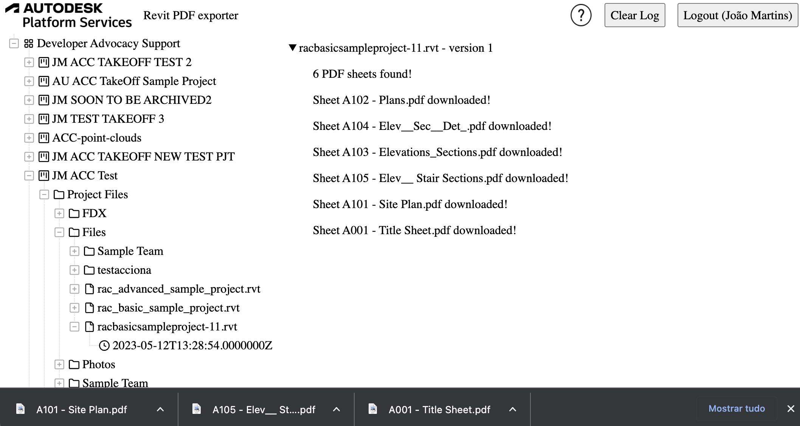
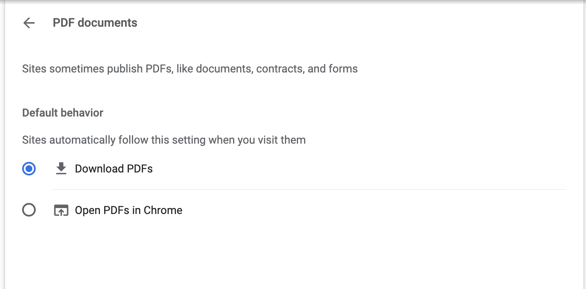
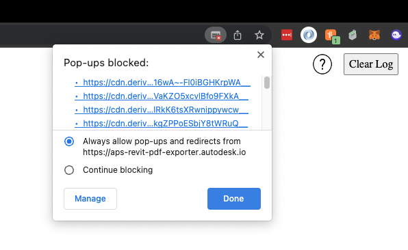

# Revit PDFs Exporter MD


[](https://nodejs.org)
[](https://www.npmjs.com/)
[](http://opensource.org/licenses/MIT)

[](http://developer.autodesk.com/)
[](http://developer.autodesk.com/)
[](http://developer.autodesk.com/)
[](http://developer.autodesk.com/)
[](http://developer.autodesk.com/)

This sample shows a way to export PDFs from a Revit designs using Model Derivative.

### DEMO: aps-revit-pdf-exporter.autodesk.io/

### Introduction

When you submit a translation for a Revit 2022 file or later, it generates the 2D views as PDFs (refer [here](https://aps.autodesk.com/blog/advanced-option-rvtdwg-2d-views-svf2-post-job)).
We can take advantage of this fact to download these PDFs wherever they're available (Bucket, ACC, BIM 360...).
Many workflows are possible in this scenarion, integrating with Webhooks, 3rd party services, other products...



### The approach

We are basically take advantage of the [manifest](https://aps.autodesk.com/en/docs/model-derivative/v2/reference/http/manifest/urn-manifest-GET/) in order to list and filter all the 2D views, and from there we can download the derivative using the [Derivative Download endpoint](https://aps.autodesk.com/en/docs/model-derivative/v2/reference/http/urn-manifest-derivativeUrn-signedcookies-GET/), just like in the snippet below:

```js
service.getDownloadUrls = async (version_id, token) => {
  const resp = await new APS.DerivativesApi().getManifest(
    version_id.replace("-", "/"),
    null,
    internalAuthClient,
    token
  );
  let derivatives = resp.body.derivatives[0].children;
  let pdfViews = derivatives.filter(
    (v) => v.role == "2d" && !!v.properties["Print Setting"]
  );
  let pdfDerivatives = pdfViews.map((v) =>
    v.children.find((d) => d.role == "pdf-page")
  );
  let downloadUrls = [];
  for (const derivative of pdfDerivatives) {
    let newDerivativeUrl = await getSignedUrlFromDerivative(
      version_id.replace("-", "_"),
      derivative,
      token
    );
    downloadUrls.push(newDerivativeUrl);
  }
  // return downloadUrls;
  return {
    derivatives: downloadUrls,
    RVTVersion:
      resp.body.derivatives[0].properties["Document Information"].RVTVersion,
  };
};

async function getSignedUrlFromDerivative(urn, derivative, token) {
  let url = `https://developer.api.autodesk.com/modelderivative/v2/designdata/${urn.replaceAll(
    "=",
    ""
  )}/manifest/${derivative.urn}/signedcookies?useCdn=true`;

  let options = {
    method: "GET",
    headers: {
      Authorization: "Bearer " + token.access_token,
    },
  };

  let resp = await fetch(url, options);
  let respJSON = await resp.json();
  let policy = resp.headers.raw()["set-cookie"][0].split("=")[1].split(";")[0];
  let keypair = resp.headers.raw()["set-cookie"][1].split("=")[1].split(";")[0];
  let signature = resp.headers
    .raw()
    ["set-cookie"][2].split("=")[1]
    .split(";")[0];
  let data = {
    name: derivative.urn.split("/").slice(-1)[0],
    url: respJSON.url,
    "CloudFront-Policy": policy,
    "CloudFront-Key-Pair-Id": keypair,
    "CloudFront-Signature": signature,
  };

  return data;
}
```

In this case, we're downloading the PDFs from BIM 360/ACC, so we just need a version id.

## Development

### Prerequisites

- [APS credentials](https://forge.autodesk.com/en/docs/oauth/v2/tutorials/create-app)
- Provisioned access to [BIM 360 Docs](https://forge.autodesk.com/en/docs/bim360/v1/tutorials/getting-started/manage-access-to-docs/)
  or Autodesk Construction Cloud
- [Node.js](https://nodejs.org) (we recommend the Long Term Support version)
- Terminal (for example, [Windows Command Prompt](https://en.wikipedia.org/wiki/Cmd.exe)
  or [macOS Terminal](https://support.apple.com/guide/terminal/welcome/mac))

### Setup & Run

- Clone this repository
- Install dependencies: `yarn install` or `npm install`
- Setup environment variables:
  - `APS_CLIENT_ID` - your APS application client ID
  - `APS_CLIENT_SECRET` - your APS application client secret
  - `APS_CALLBACK_URL` - URL for your users to be redirected to after they successfully log in with their Autodesk account
    - For local development, the callback URL is `http://localhost:8080/api/auth/callback`
    - For applications deployed to a custom domain, the callback URL is `http://<your-domain>/api/auth/callback` or `https://<your-domain>/api/auth/callback`
    - Do not forget to update the callback URL for your application in https://forge.autodesk.com/myapps as well
  - `SERVER_SESSION_SECRET` - arbitrary phrase used to encrypt/decrypt server session cookies
- Run the server: `yarn start` or `npm start`

> When using [Visual Studio Code](https://code.visualstudio.com),
> you can specify the env. variables listed above in a _.env_ file in this
> folder, and run & debug the application directly from the editor.

### Troubleshooting

For this workflow to work, your Revit file needs to be from version 2022 or later, and it needs to be published after November 4th of 2021.
This last restriction is because only after this date the extractor started adding the Revit version in the manifest (refer to [this blog](https://aps.autodesk.com/blog/check-version-revit-file-hosted-cloud)).

Also, for it to download the PDFs you might need to change your browser settings (allow pop-ups and download PDFs instead of showing in new tab).

Refer here to configure your browser to download PDFs instead of opening them in a new tab: https://www.howtogeek.com/721441/how-to-download-pdfs-instead-of-previewing-them-in-chrome-firefox-and-edge/


Refer here to configure your browser to allow pop-ups (each PDF we download opens a new pop-up): https://blog.getadblock.com/how-to-disable-pop-up-blockers-in-every-browser-a1cccbae53e7


## License

This sample is licensed under the terms of the [MIT License](http://opensource.org/licenses/MIT). Please see the [LICENSE](LICENSE) file for full details.

## Written by

João Martins [@JooPaulodeOrne2](http://twitter.com/JooPaulodeOrne2), [APS Partner Development](http://aps.autodesk.com)
